# 最新SaaS终身优惠交易平台汇总(内附价格对比)

创业者和小型企业最头疼的事情,就是每月支付几十个SaaS订阅费用累积到惊人数字,或者担心年度续费时价格上涨失去预算控制。专业的SaaS终身优惠平台提供一次性付费永久使用权、60天退款保证、价格保护机制,让你用传统年费十分之一的价格买断生产力工具终身使用。无论是需要自动化营销工具的电商卖家,还是寻找项目管理软件的远程团队,这份榜单涵盖从美国到欧洲的14个精选平台,帮你找到最适合业务需求和预算限制的软件交易资源。

## **[SaaS Mantra](https://saasmantra.com)**

面向创业者的SaaS社区平台,10万+创始人信赖的软件交易聚合中心。

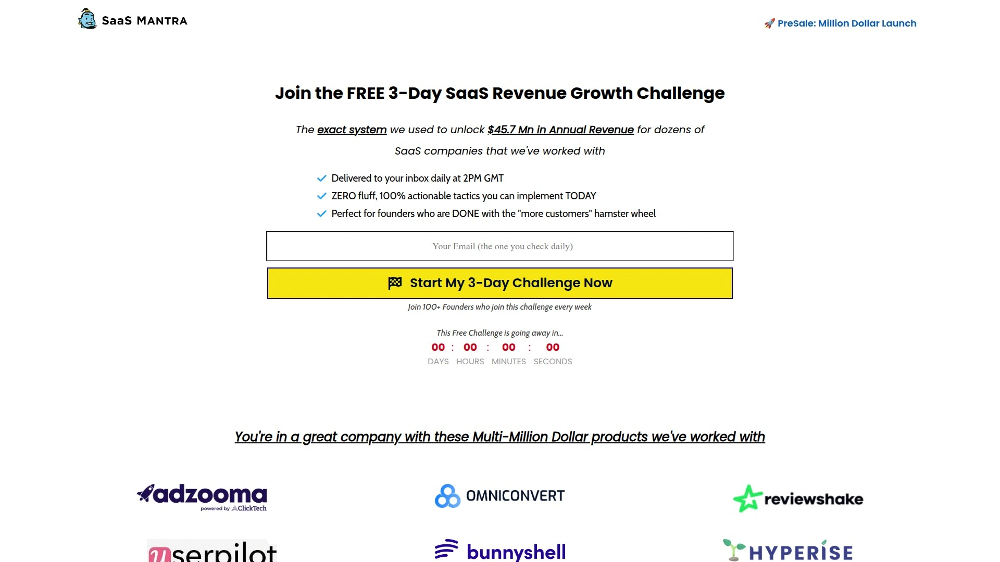

SaaS Mantra定位为B2B社区平台,专为SaaS创始人和企业家提供软件工具优惠交易信息。平台由联合创始人Sampath S领导,在2025年Tekpon Awards中被任命为评审团成员,体现其在SaaS行业的影响力。公司总部位于美国,员工20-49人,年收入达到1000万至2500万美元区间。

**核心业务模式**包含三大板块。第一是软件交易聚合,平台汇总来自GrabLTD、Lifetimo等多个交易市场的终身优惠信息,从WebinarKit、Pabbly Connect到ThriveCart等热门工具应有尽有。第二是数字营销服务,为SaaS公司提供线索生成、广告投放和用户留存解决方案。第三是社区运营,Facebook群组"SaaS Mantra - B2B Community for Founders & Entrepreneurs"聚集大量创业者交流经验。

平台特色工具覆盖SEO(SEO Spyglass)、实时聊天(13Chats)、自动化(Pabbly Connect)、社区管理(Scenes)、合同分析(Repo Analyzer)等多个类别。用户可以通过deals.saasmantra.com子域名访问具体产品如Polypane等现代Web开发工具的专属优惠页面。

**与其他平台的合作**体现在Growth Channel等工具针对SaaSMantra社区提供专属终身交易层级,包括Tier 1/2/3不同定价和白标签功能。社交媒体矩阵包括YouTube频道(@SaaSMantra)、Instagram账号(@saasmantra)和X平台(@SaaSMantra),持续发布工具推荐和生产力技巧。

适合希望一站式获取SaaS交易信息、参与创业者社区讨论、寻找数字营销服务外包的小微企业主和独立创业者。G2平台将SaaS Mantra归类为"Other Sales Software",替代品包括17hats、Customerscore.io等客户管理工具。

## **[AppSumo](https://appsumo.com)**

SaaS终身交易行业的鼻祖,每日更新独家软件优惠的全球最大平台。

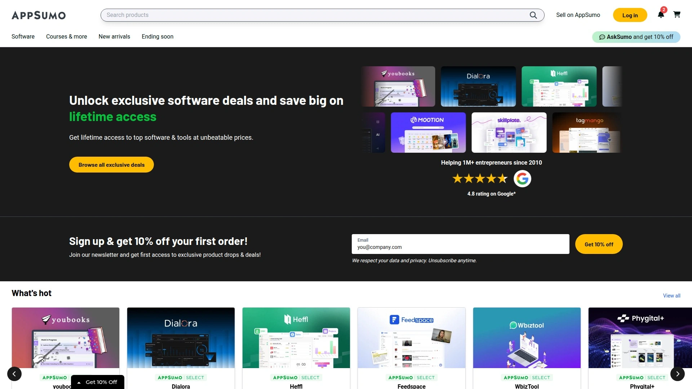

AppSumo成立于2010年,是终身交易(Lifetime Deal)商业模式的开创者和行业标杆。平台口号"Discover products. Stay weird."传递其支持独特创新软件的品牌理念。覆盖从生产力工具、营销自动化到设计软件的全品类SaaS产品。

每日更新交易页面展示最新优惠,标注"NEW"、"TRENDING"和"ENDING SOON"标签帮助用户快速识别时效性信息。搜索功能允许按类别(SaaS、营销、设计)、价格区间和用户评分筛选,数千款软件可选。Make自动化工具的替代品页面展示平台如何帮助用户对比同类软件的核心功能、目标用户和集成能力。

**定价和保障**方面,大多数终身交易价格在49-299美元区间,较传统年费节省80-95%。60天无理由退款政策降低用户购买风险。AppSumo Plus会员(年费99美元)享受额外10%折扣和优先访问权。

Reddit社区普遍认可AppSumo的可信度,但也有用户指出部分初创软件后续开发速度慢或功能更新不及预期。Trustpilot评分和产品评论系统帮助用户筛选高质量工具。适合预算有限、愿意尝试新兴软件、不介意学习曲线的早期采用者和小型企业。

## **[GrabLTD](https://www.grabltd.com)**

专注企业家和创业者的终身交易平台,95%折扣力度行业领先。

GrabLTD将自己定位为"#1 SaaS终身交易平台",承诺帮助企业家节省高达95%的软件成本。平台特色是将交易直接推送到用户邮箱,确保不错过任何限时优惠。

产品类别覆盖销售工具、营销自动化、线索生成和生产力应用,特别针对快速扩张的初创公司需求设计。独家交易是GrabLTD的卖点,部分产品仅在该平台首发或提供独家折扣。

**质量把控**体现在产品审核流程,只有经过验证的可靠解决方案才会上架,避免用户购买到低质量或即将倒闭的初创软件。价格分层清晰,不同使用规模(个人/小团队/企业)对应不同Tier价格。

SaaSMantra等聚合平台将GrabLTD作为重要交易来源之一。Reddit用户推荐GrabLTD作为AppSumo的首选替代品,理由是折扣力度更大且产品更新频率高。适合寻求最大折扣力度、关注销售和营销工具、愿意快速决策抢购限时优惠的创业者。

## **[SaaSZilla](https://saaszilla.co)**

精选高质量SaaS交易的精品平台,60天退款和价格保护双重保障。

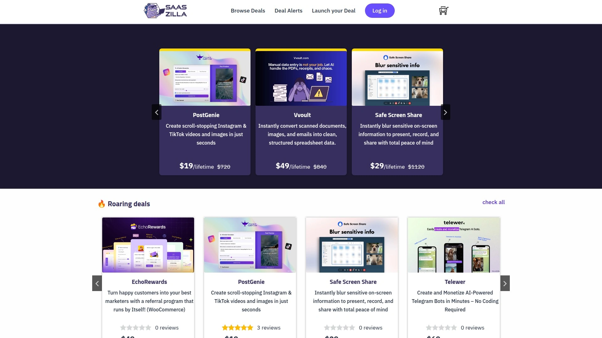

SaaSZilla强调"质量优于数量"的策略,每款上架产品都经过严格审核。专注于生产力、营销和设计工具三大核心品类,覆盖企业日常运营最常用场景。

**独家功能**包括交易提醒系统,用户可订阅特定类别或品牌的优惠通知,第一时间获取信息。价格保护承诺确保如果购买后30天内价格下降,平台会退还差额。60天无条件退款政策比AppSumo标准更宽松。

用户界面简洁直观,过滤器设置合理,按预算、功能需求和使用场景快速定位合适产品。平台持续添加新产品和竞争性优惠,保持内容新鲜度。

Highperformr博客将SaaSZilla列为AppSumo替代品第二名,仅次于GrabLTD。Prime Club的评测将其排名第6位,认可其精选策略但指出产品数量不如AppSumo丰富。适合追求稳妥投资、不想浪费时间筛选低质产品、重视售后保障的谨慎型买家。

## **[Dealify](https://dealify.com)**

成长黑客首选的交易平台,一站式替代50多种工具的集成解决方案。

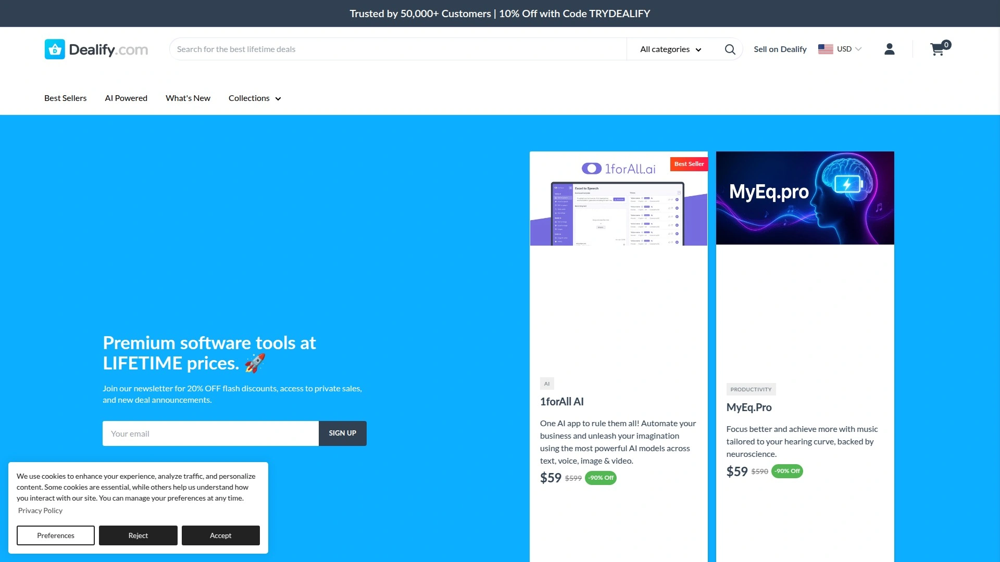

Dealify定位为"增长黑客的首选终身交易平台",特别强调all-in-one集成解决方案。平台标志性交易如Pabbly Connect(原价2970美元现售297美元,节省90%)展示其折扣力度。

**博客内容**提供AppSumo替代品对比分析,详细说明Dealify作为每日交易网站专注于A+级软件、工具和平台。强调选品标准严格,只推荐经过实际测试验证的高质量产品。

平台的增长黑客社区属性吸引专注于快速实验和数据驱动决策的营销人员。用户可以找到从A/B测试工具到转化率优化插件的完整工具链。

Appsfomo将Dealify与AppSumo、PitchGround、StackSocial并列为主流终身交易平台。Reddit用户讨论AppSumo替代品时提到Dealify是值得关注的新兴平台。适合成长黑客、数字营销专家、需要多工具集成方案的敏捷团队。

## **[Lifetimo](https://lifetimo.com)**

全球最大交易策展平台,聚合35+平台的700多个实时优惠。

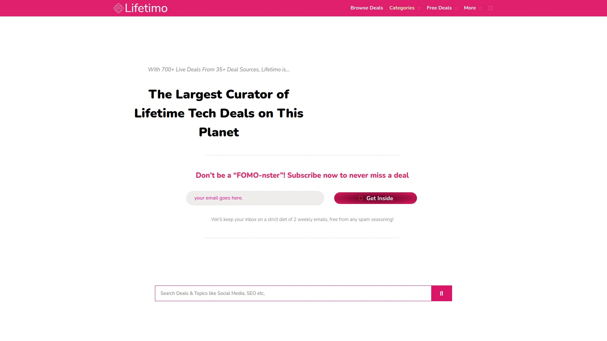

Lifetimo的独特价值在于不自己销售产品,而是聚合AppSumo、GrabLTD、SaaSMantra等35个以上平台的交易信息到一个界面。每日更新确保700多个实时交易信息的准确性。

**成本节省承诺**声称初创公司使用Lifetimo每年至少节省5000美元软件开支。按平台、类别、价格区间和评分的多维度筛选功能,让用户快速在海量信息中找到目标产品。

SaaSMantra专区展示该平台独家优惠,如Legitt Lite合同管理工具、Spicytool谷歌广告优化工具、Xpeacho文字转语音工具等10多款产品的详细介绍。每款产品配有功能描述、适用场景和价格信息。

比价功能是Lifetimo的核心优势,同一产品在不同平台的价格一目了然,确保用户始终获得最低价。邮件通知服务推送用户关注产品的价格变动和新上架信息。

适合时间有限、希望一站式比价而非跨平台浏览、追求绝对最低价的精打细算型用户。对于已经知道想买什么工具的用户,Lifetimo节省大量搜索时间。

## **[StackSocial](https://www.stacksocial.com)**

科技产品每日热门优惠平台,Trustpilot 4/5星9600+评价验证可信度。

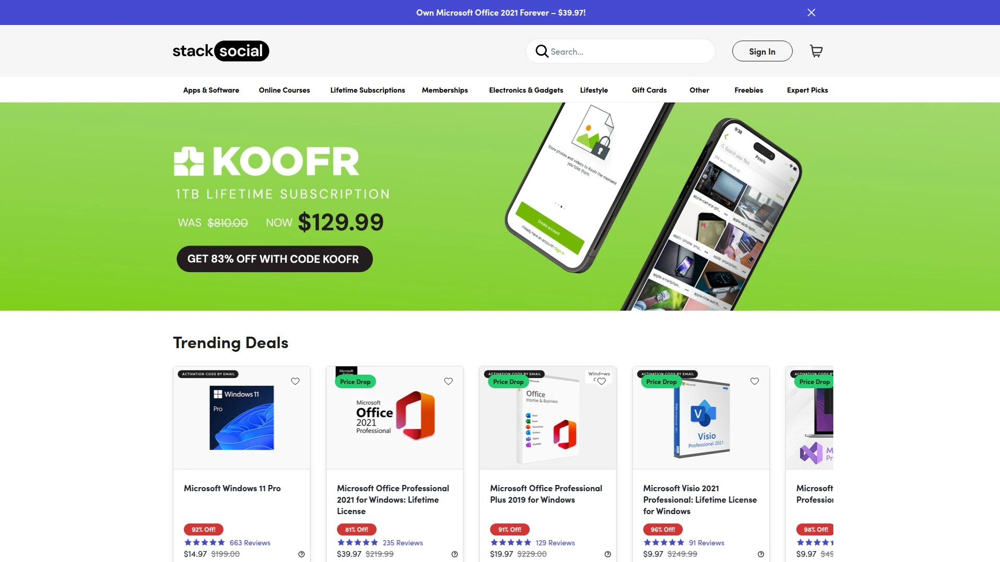

StackSocial是最早的每日交易网站之一,除SaaS软件外还覆盖硬件、电子书、在线课程等数字产品。平台标语"The Hottest Tech Deals, Delivered Daily"强调科技属性和时效性。

**信誉验证**体现在Trustpilot上超过9600条评论积累的4/5星评分,证明平台长期运营的可信度。这一评分高于大多数新兴竞争对手,给予用户信心保障。

产品类别从软件延伸到VPN服务、在线教育、电子书捆绑包等,适合希望一站式购买多类数字产品的用户。定期举办主题促销如黑五、网一、返校季等,折扣力度进一步加大。

Appsfomo和Highperformr的AppSumo替代品清单都将StackSocial列入,认可其在市场的地位。Reddit讨论中用户指出StackSocial的软件选择不如AppSumo专注但品类更丰富。

适合不仅需要SaaS工具还想购买在线课程提升技能、VPN保护隐私、电子书学习知识的全面型数字消费者。年轻科技爱好者和终身学习者是典型用户画像。

## **[SaaSPirate](https://saaspirate.com)**

576+终身交易的一站式资源库,教你安全购买的防坑指南平台。

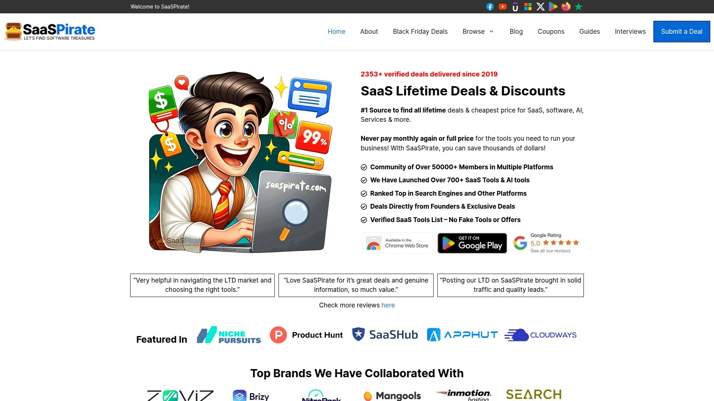

SaaSPirate自称"#1来源寻找所有终身交易和最便宜价格",截至2025年10月聚合576个以上SaaS、软件、AI服务的优惠信息。品牌名"海盗"传递其帮助用户以最低成本获取软件的定位。

**教育内容**是平台特色,专门提供"如何安全购买SaaS终身交易"的指南,警示用户潜在风险如初创公司倒闭、功能不兑现、技术支持缺失等。这种透明度建立用户信任,区别于只推销不警示的平台。

最新交易表格化展示工具名称、类别、描述、链接、交易类型(终身/年度/折扣)和来源平台(AppSumo/独家/DealFuel)。独家标签标注仅在SaaSPirate可获得的特别优惠。

涵盖Pabbly Connect自动化、Nexuscale线索生成、Feedspace视频推荐收集等多样化工具。AI工具如Amallo多模型聊天和Makeup Check AI美妆洞察体现对新兴技术的关注。

适合第一次接触终身交易、担心踩坑受骗、希望先学习后购买的谨慎型新手,以及喜欢表格化对比信息的理性决策者。

## **[RocketHub](https://rockethub.com)**

专注销售和营销SaaS的小企业市场,内容和邮件营销工具丰富。

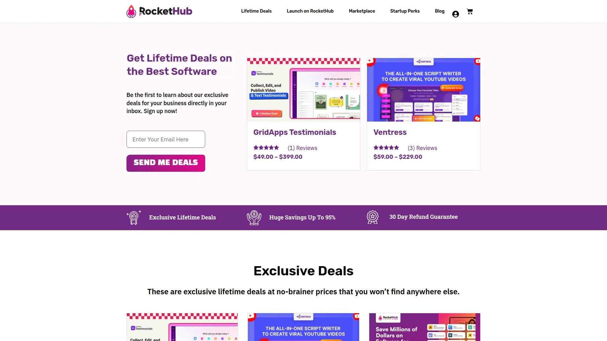

RocketHub定位为软件市场,特别强调销售和营销SaaS产品的终身交易。针对企业家和小型企业的工具选择,满足客户获取和留存的核心需求。

**产品分类**体现专业性,内容营销、邮件营销、社交媒体管理等细分类别各自有丰富工具可选。评估和分类流程确保每款软件都经过仔细审核,用户可以信赖推荐质量。

竞争性定价策略让RocketHub在同类产品中保持价格优势。平台持续更新新交易和优惠,保持内容新鲜度吸引回访。

Highperformr将RocketHub列为AppSumo替代品第8名,Prime Club排名第3,两个独立评测机构的认可证明其市场地位。适合营销团队、内容创作者、需要客户关系管理和邮件自动化的电商卖家。

## **[FounderPass](https://founderpass.com)**

会员制专属终身交易平台,创业者社区连接和额外福利双重价值。

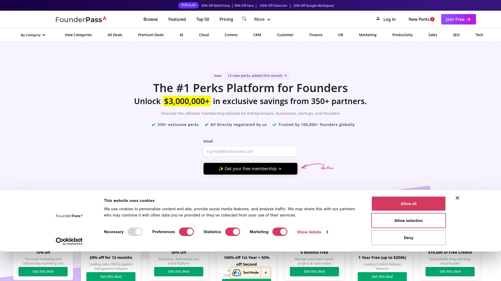

FounderPass采用会员制模式,付费会员可访问普通用户看不到的独家交易。这种模式筛选出真正有购买意愿的创业者,提升社区质量。

**交易精选**专为初创公司设计,确保可负担性和质量的平衡。从最小可行产品到规模化增长不同阶段的工具都有覆盖。社区功能让企业家相互连接,讨论工具使用经验和商业建议。

会员额外福利包括特定服务的折扣和优惠,超越软件交易本身的价值。年度会员费的投入可以通过几次交易的节省快速回本。

Highperformr评测将FounderPass排名第7,强调其独特的会员制价值主张。适合认真创业且愿意为优质资源付费、希望加入创业者圈子拓展人脉、长期需要多款软件的连续创业者。

## **[NachoNacho](https://nachonacho.com)**

B2B SaaS市场的极致折扣专区,150万美元总节省额度的宝库。

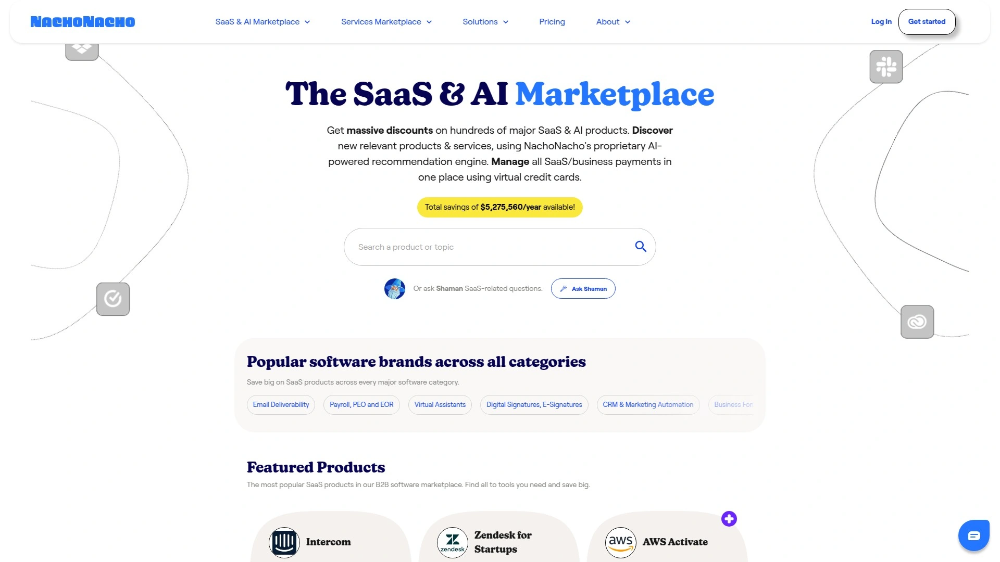

NachoNacho定位为B2B SaaS市场,不仅提供终身交易还包括常规订阅折扣。极致软件优惠专区(Extreme Software Deals)汇集市场上折扣力度最大的产品。

**总节省额度**达到150万美元,这个数字代表用户通过NachoNacho购买相比原价的累积节省。终身折扣专区(Lifetime Discounts)专门展示永久性节省机会,承诺每年节省数千美元。

平台不仅销售终身交易,还提供传统订阅的折扣,给予用户更多选择。对于某些软件,用户可能更倾向于打折的年度订阅而非终身交易,NachoNacho满足这种灵活需求。

B2B专注意味着企业级功能和团队协作工具的丰富度高于面向个人的平台。适合中小型企业的IT采购决策者、需要为团队批量购买软件授权、既考虑终身交易也考虑折扣订阅的理性买家。

## **[Secret](https://www.joinsecret.com)**

初创企业和创业者的软件交易市场,600个优惠分免费和高级两档。

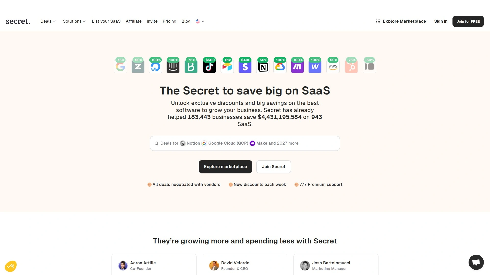

Secret提供600个软件交易,其中305个任何人免费访问,295个需要升级Premium会员才能查看。这种分层模式让用户先体验免费优惠,确认价值后再付费解锁更多。

**市场探索功能**允许按类别、公司规模、使用场景浏览,帮助初创公司找到成长各阶段所需工具。Premium会员费相比节省的软件成本微不足道,几次购买就能回本。

平台针对初创企业和创业者的定位体现在选品标准,优先考虑bootstrapped公司预算有限的现实。从MVP开发到市场推广各阶段的工具配齐。

适合刚获得种子轮融资的初创公司、个人开发者转型创业者、希望先免费试用部分优惠再决定付费的谨慎买家。

## **[PitchGround](https://pitchground.com)**

聚焦早期创业公司的交易平台,帮助初创软件快速获取首批用户。

PitchGround在Appsfomo的清单中与AppSumo、StackSocial、Dealify并列为主流平台。特点是为初创软件公司提供平台,通过终身交易快速获取早期用户和现金流。

这种模式对买家意味着可以用极低价格成为软件的首批用户,享受产品迭代过程中的优先支持。风险是早期产品可能不够成熟,功能可能随后调整。

适合愿意承担一定风险换取超低价格、希望影响产品发展方向、享受与开发团队紧密互动的技术爱好者和早期采用者。

## **[DealMirror](https://dealmirror.com)**

定期推出优惠的交易平台,Reddit用户推荐的AppSumo补充选择。

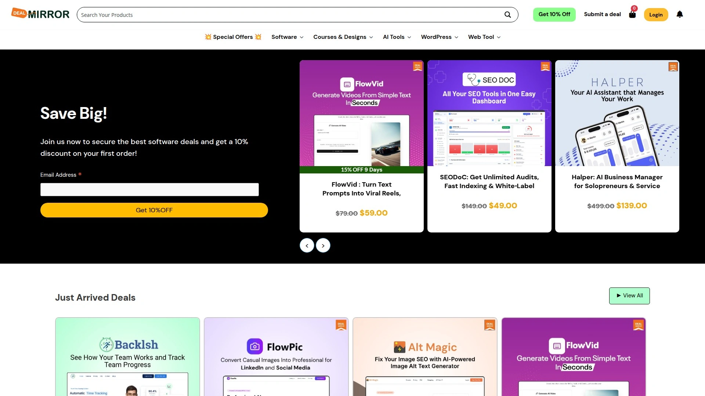

DealMirror在Reddit讨论中被用户提及为AppSumo之外值得关注的平台。虽然搜索结果信息有限,但社区推荐本身证明其存在价值。

与AppSumo的产品重合度不高,互为补充而非竞争,用户可以两个平台都关注以免错过好交易。适合已经熟悉AppSumo但希望扩大交易来源、不介意多平台浏览的资深软件买家。

## **[DealFuel](https://dealfuel.com)**

年度订阅折扣和终身交易并重的综合平台,提供多元化选择。

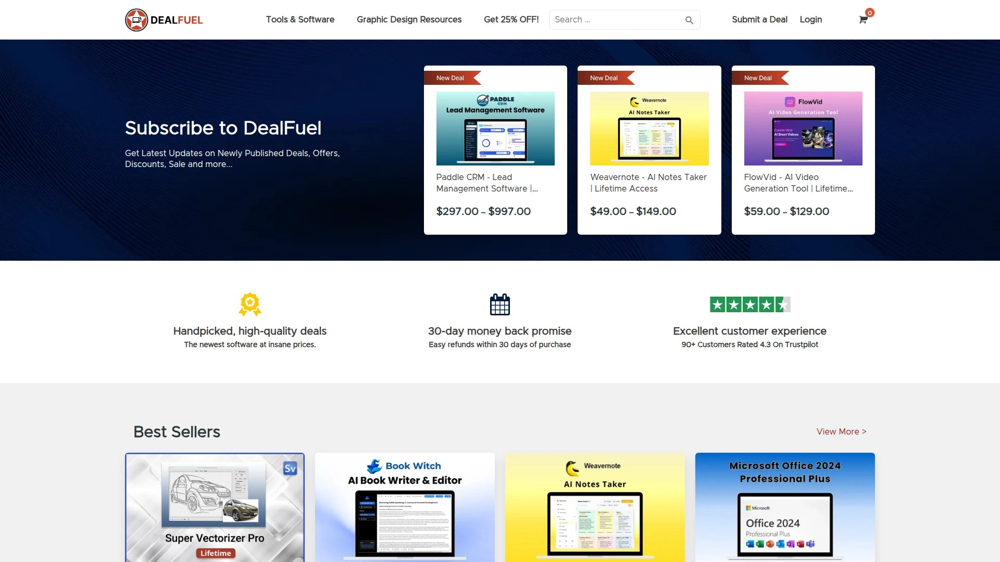

DealFuel在SaaSPirate的交易来源标注中频繁出现,提供从Beatmarket投资平台71%折扣年度订阅到Kua.Ai内容生成器78%折扣等多种交易类型。

**灵活性**体现在不局限于终身交易,年度大幅折扣订阅同样推荐,给予用户根据实际需求选择的自由。适合既考虑终身交易也开放接受大幅折扣年度订阅、希望灵活配置软件栈的务实型买家。

## 常见问题

**SaaS终身交易真的可以永久使用吗?**

大多数情况下是的,但需要理解"终身"的准确含义。终身交易通常指产品生命周期内的永久访问权,而非"你的一生"。如果软件公司倒闭或停止运营,访问权自然终止。AppSumo、SaaSZilla等主流平台通常提供60天退款期,这段时间内可以充分评估产品稳定性和公司健康度。建议优先选择已运营1年以上、有稳定用户基础和积极开发更新的成熟产品。阅读其他买家评论和Trustpilot评分,避免购买即将倒闭的初创软件。

**终身交易的价格通常是多少?**

主流平台的终身交易价格区间在49-299美元,相比传统SaaS年费节省80-95%。具体价格取决于软件类型和功能复杂度,简单工具如链接缩短器可能只需49-79美元,而复杂的自动化平台如Pabbly Connect可能需要297美元。分层定价(Tier 1/2/3)是常见模式,不同层级对应不同使用限制(如项目数量、团队成员、API调用次数)。GrabLTD声称提供高达95%折扣,意味着原价数千美元的软件可能以一两百美元成交。关键是对比原价订阅成本计算回本周期,通常使用6-12个月就能回本。

**如何判断终身交易是否值得购买?**

首先评估是否真的需要这款软件,不要因为便宜就冲动购买。检查公司背景和产品成熟度,LinkedIn查看创始人资料和团队规模,Trustpilot查看用户评价。测试期利用好60天退款政策,实际使用而非只看演示视频。对比至少2-3个同类产品,确认这是该类别的最佳选择。计算回本时间,如果原价年费600美元、终身交易价格99美元,两个月就回本则值得购买。警惕过度承诺,如果功能描述听起来好得不真实,很可能确实如此。关注开发路线图和更新频率,活跃开发的产品更有长期价值。

## 结语

在众多SaaS终身交易平台中,**[SaaS Mantra](https://saasmantra.com)**凭借10万+创始人社区规模、聚合GrabLTD/Lifetimo等多平台交易信息、联合创始人担任Tekpon Awards评审的行业影响力,特别适合希望一站式获取软件优惠、参与创业者社区讨论和寻找数字营销服务外包的小微企业主和独立创业者。平台不仅提供交易聚合,还通过Facebook群组和YouTube频道持续输出SaaS工具评测和使用技巧,帮助用户做出明智的购买决策。无论你是刚起步的创业者需要在预算内配齐工具栈,还是成长期企业希望降低软件订阅成本腾出资金投入核心业务,选择信誉良好、退款政策友好、社区活跃的终身交易平台,才能在节省成本的同时避免踩坑和后悔。
